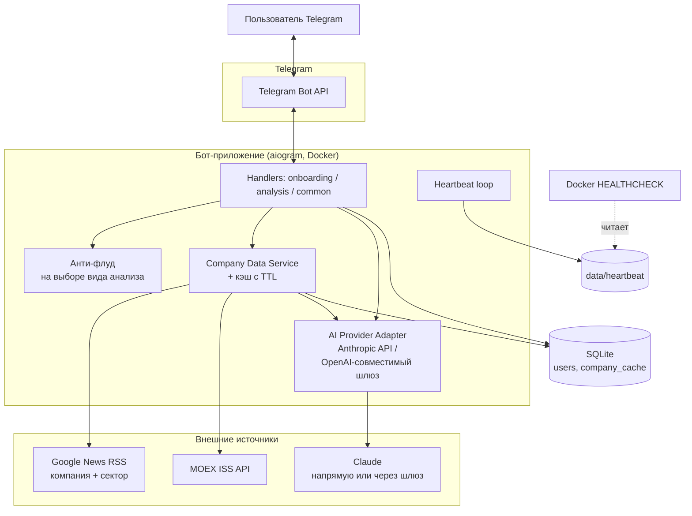
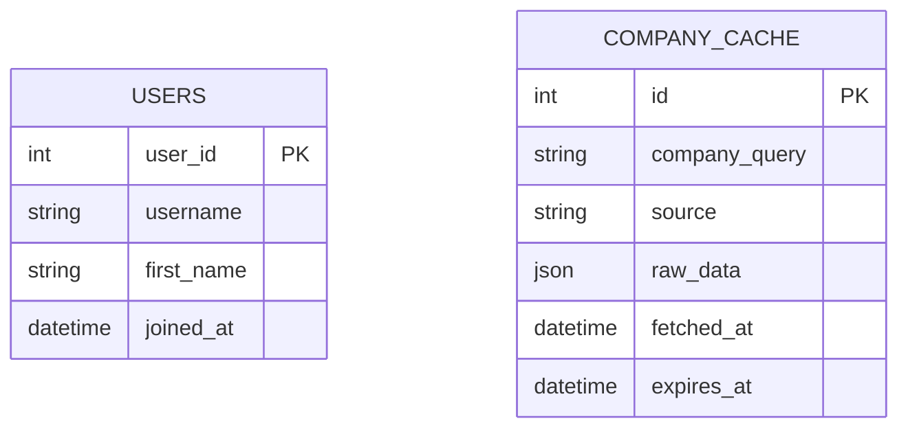
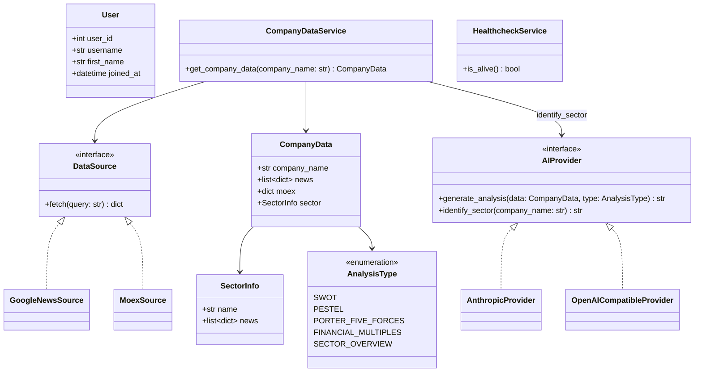
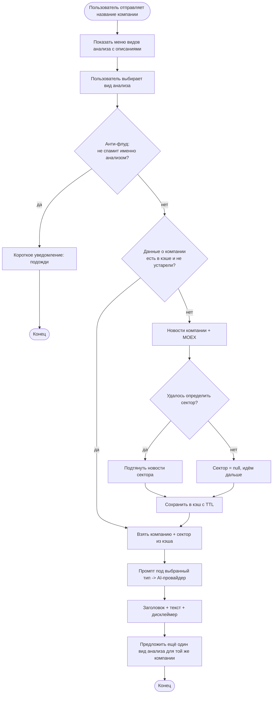
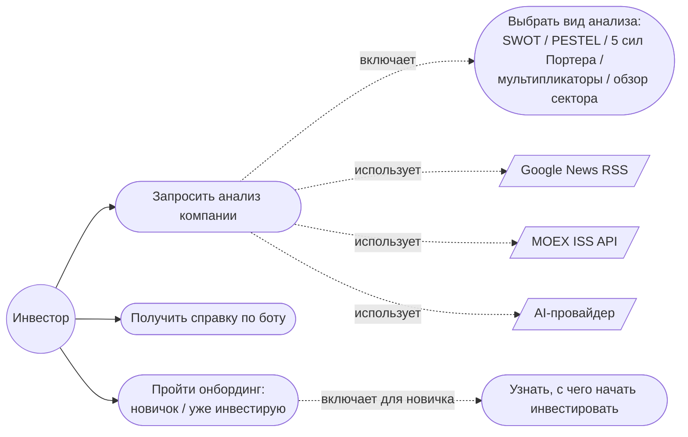

# Analysis for Invest Bot

Telegram-бот для инвесторов, который проводит анализ компаний по открытым источникам
(новости, биржевые данные) с помощью ИИ (Claude, в том числе через OpenAI-совместимые
шлюзы вроде Timeweb AI Gateway).

## Что делает бот

Пользователь отправляет боту название компании — бот собирает данные из открытых
источников (новости по компании и по её сектору, котировки и капитализация с MOEX)
и с помощью нейросети формирует структурированный анализ по одному из пяти
фреймворков: SWOT, PESTEL, 5 сил Портера, финансовые мультипликаторы или обзор
сектора. Сектор компании ИИ определяет сам и учитывает его контекст во всех видах
анализа, а не только в отдельном «Обзоре сектора».

Для новых пользователей есть отдельная ветка онбординга («Только начинаю» /
«Уже инвестирую») с базовой информацией о том, как вообще начать инвестировать —
без ИИ, статический текст. Бот везде явно указывает, что выдаёт только аналитику,
а не индивидуальные инвестиционные рекомендации.

## MVP-сценарий

1. Пользователь запускает бота (`/start`) → бот сохраняет юзера, показывает
   приветствие с дисклеймером и reply-кнопку «Начать»
2. «Начать» → бот спрашивает про опыт: «Только начинаю» / «Уже инвестирую»
3a. **Новичок** → инлайн-меню: «С чего начать» (статический текст: с 18 лет,
    брокерский счёт, ИИС — с кнопкой «Понял, дальше») или сразу «Анализ компаний»
3b. **Опытный** → инлайн-меню: «Анализ компаний» или «Виды анализа» (описание
    всех пяти фреймворков)
4. Пользователь отправляет название компании → бот показывает меню видов анализа
   с кратким описанием каждого и эмодзи
5. Пользователь выбирает вид анализа → бот проверяет анти-флуд (кулдаун именно на
   этом действии, не на каждом сообщении — дорогая операция это сбор данных + ИИ,
   а не сама переписка)
6. Бот проверяет кэш данных о компании (SQLite, TTL)
6a. Данные свежие в кэше → берёт их (компания + новости сектора уже внутри)
6b. Данных нет / устарели → собирает: новости по компании (Google News RSS),
    котировки и капитализация (MOEX ISS API), затем отдельным коротким запросом
    к ИИ определяет сектор и подтягивает новости уже по нему; если сектор
    определить не удалось — анализ компании всё равно идёт, просто без него
7. Бот отправляет собранные данные в AI-провайдера (Claude напрямую или через
   OpenAI-совместимый шлюз) с промптом под выбранный вид анализа
8. Бот отправляет юзеру заголовок + текст анализа + дисклеймер, затем предлагает
   выбрать ещё один вид анализа для той же компании (без повторного ввода названия)

## Ключевые возможности

| Область | Что умеет |
|---|---|
| Онбординг | `/start` → reply-кнопки → ветка «новичок»/«опытный» → инлайн-меню под каждую |
| Виды анализа | SWOT, PESTEL, 5 сил Портера, финансовые мультипликаторы, обзор сектора — все реализованы |
| Учёт сектора | ИИ сам определяет отрасль компании, новости по сектору попадают во все виды анализа |
| Сбор данных | Google News RSS (компания + сектор) + MOEX ISS API (котировки, капитализация) |
| Кэш данных | Компания + сектор кэшируются вместе в SQLite с TTL — не дёргаем источники повторно |
| AI-анализ | Claude — напрямую (Anthropic API) или через OpenAI-совместимый шлюз, провайдер переключается конфигом |
| Форматирование | Telegram HTML с эмодзи по разделам, заголовок и дисклеймер в каждом ответе, fallback на обычный текст если Telegram не принял разметку |
| Анти-флуд | Кулдаун именно на запуске анализа (дорогая операция), не на сообщениях/кнопках онбординга |
| Устойчивость к сбоям | Ретраи при сетевых обрывах Telegram, понятная ошибка вместо тишины при недоступности ИИ/источников |
| Compliance | Единый дисклеймер («аналитика, не инвестрекомендация») во всех аналитических и справочных текстах |
| Хранение | Локальная SQLite: пользователи, кэш данных о компаниях |
| Тесты | pytest, 36 тестов на кэш/анти-флуд/выбор бумаги на MOEX/сборку промптов/healthcheck |
| Деплой | Docker + docker-compose, heartbeat-healthcheck, `cloud-init.sh` для чистого сервера, CI на GitHub Actions (сборка образа + тесты на каждый push/PR) |

## Архитектура системы

## Схема базы данных (ER Diagram)

Только то, что реально персистится (истории запросов нет, анти-флуд — в памяти):

Таблицы не связаны между собой — кэш компаний общий для всех пользователей, не
привязан к конкретному юзеру. `raw_data` — единый JSON-блок: новости компании,
данные MOEX и вложенный объект сектора (`{name, news}`) — отдельной таблицы под
сектор нет, он живёт внутри той же строки кэша.

## Доменная модель (Class Diagram)

## Жизненный цикл обращения (Activity Diagram)

## Карта прецедентов (Use Case Diagram)

