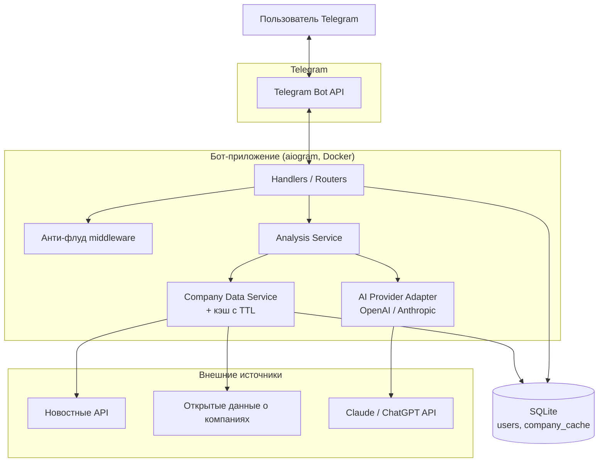
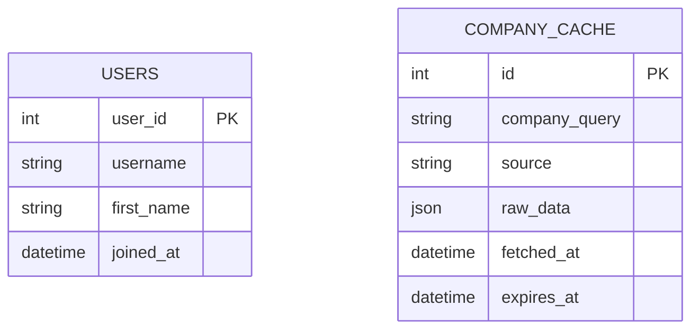
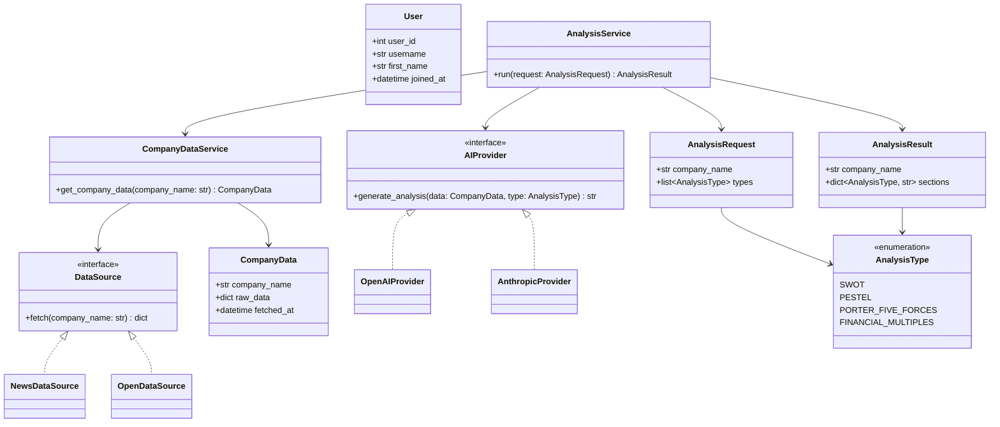
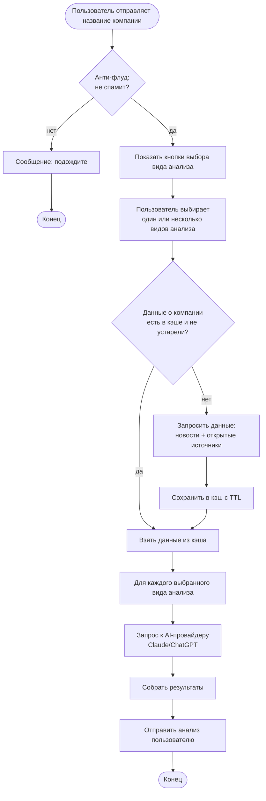
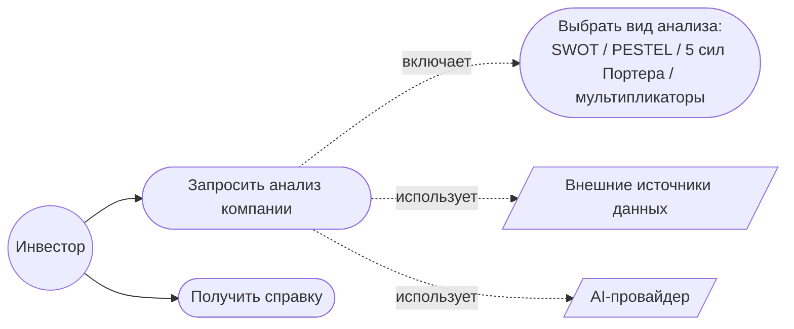

# Analysis for Invest Bot

Telegram-бот для инвесторов, который проводит анализ компаний по открытым источникам
(новости, отчётность, публичные данные) с помощью ИИ (ChatGPT / Claude).

## Что делает бот

Пользователь отправляет боту название компании — бот собирает информацию из проверенных
открытых источников и с помощью нейросети формирует структурированный анализ компании
по одному или нескольким аналитическим фреймворкам (например, по типу SWOT), помогая
пользователю принять взвешенное инвестиционное решение.

Функциональность бота (набор кнопок, доступные виды анализа и т.д.) находится в разработке
и будет расширяться.

## MVP-сценарий

1. Пользователь запускает бота (`/start`) → бот сохраняет юзера
2. Пользователь отправляет название компании
3. Бот проверяет анти-флуд
4. ↓
5. Бот показывает кнопки выбора вида анализа (SWOT / PESTEL / 5 сил Портера / мультипликаторы)
6. Пользователь выбирает один или несколько видов анализа
7. ↓
8. Бот проверяет кэш данных о компании
9a. Данные свежие в кэше → берём их
9b. Данных нет / устарели → собираем из открытых источников и новостей, кладём в кэш
10. ↓
11. Бот отправляет данные в AI-провайдера (Claude / ChatGPT) отдельно по каждому выбранному виду анализа
12. Бот собирает и отправляет пользователю готовый анализ

## Ключевые возможности

| Область | Что умеет |
|---|---|
| Взаимодействие с ботом | `/start`, отправка названия компании, выбор вида анализа кнопками |
| Виды анализа | SWOT (на старте); PESTEL, 5 сил Портера, финансовые мультипликаторы — в разработке |
| Сбор данных | Новости + открытые источники о компании, агрегация под конкретный запрос |
| Кэш данных | Сырые данные о компании кэшируются с TTL — не дёргаем источники повторно |
| AI-анализ | Генерация анализа через Claude или ChatGPT, провайдер переключается конфигом |
| Хранение | Локальная SQLite: пользователи, кэш данных о компаниях |
| Анти-флуд | Защита от спам-запросов (в разработке) |
| Деплой | Docker / docker-compose для развёртывания на сервере |

## Архитектура системы

## Схема базы данных (ER Diagram)

Только то, что реально персистится (истории запросов нет, анти-флуд — в памяти):

Таблицы не связаны между собой — кэш компаний общий для всех пользователей, не привязан
к конкретному юзеру.

## Доменная модель (Class Diagram)

## Жизненный цикл обращения (Activity Diagram)

## Карта прецедентов (Use Case Diagram)

