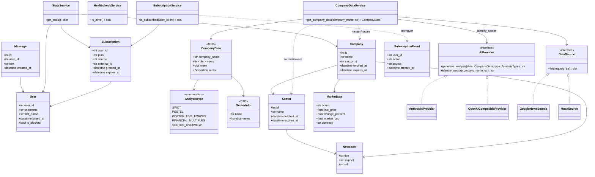
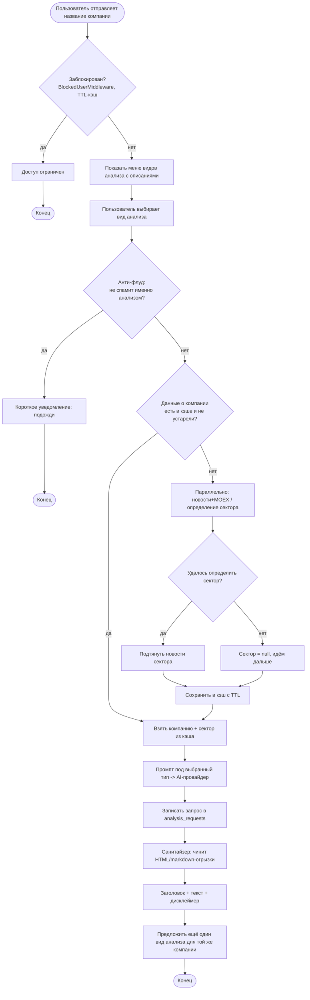
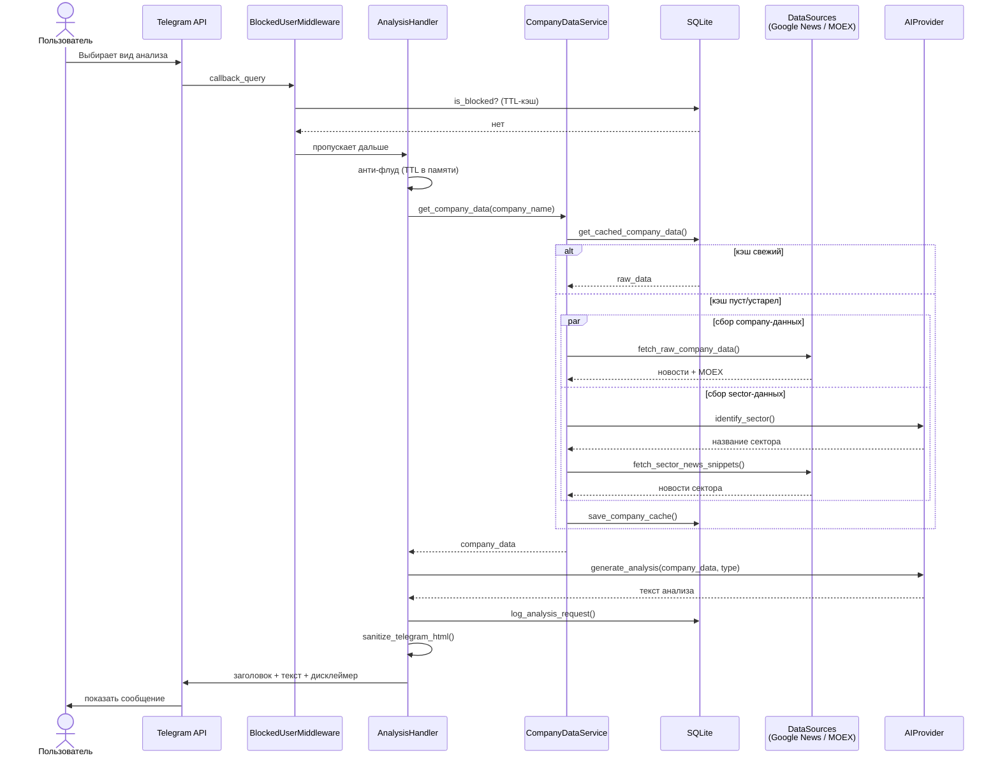
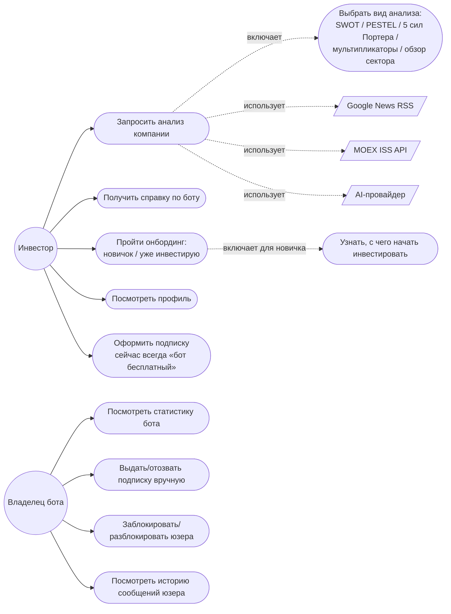

# Analysis for Invest Bot

**Бот в Telegram:** @analysis_for_invest_bot

Telegram-бот для инвесторов, который проводит анализ компаний по открытым источникам
(новости, биржевые данные) с помощью ИИ (Claude, в том числе через OpenAI-совместимые
шлюзы вроде Timeweb AI Gateway).

## Что делает бот

Пользователь отправляет боту название компании — бот собирает данные из открытых
источников (новости по компании и по её сектору, котировки и капитализация с MOEX)
и с помощью нейросети формирует структурированный анализ по одному из пяти
фреймворков: SWOT, PESTEL, 5 сил Портера, финансовые мультипликаторы или обзор
сектора. Сектор компании ИИ определяет сам и учитывает его контекст во всех видах
анализа, а не только в отдельном «Обзоре сектора».

Для новых пользователей есть отдельная ветка онбординга («Только начинаю» /
«Уже инвестирую») с базовой информацией о том, как вообще начать инвестировать —
без ИИ, статический текст. Бот везде явно указывает, что выдаёт только аналитику,
а не индивидуальные инвестиционные рекомендации.

После онбординга на экране постоянно висит reply-меню «📊 Анализ» / «👤 Профиль» —
начать новый разбор или посмотреть ID и тариф можно в любой момент, не только
сразу после выбора ветки. Есть заготовка под платную подписку — реальной оплаты
пока нет ни через один платёжный сервис, но структура (таблица подписок, ручная
выдача владельцем, `/subscription`) уже готова принять вебхук, когда он появится.

Владельцу бота (`OWNER_CHAT_ID`) доступны `/stats` с аналитикой по использованию,
`/user_history` с историей сообщений конкретного юзера и ручная блокировка
(`/block_user`, `/unblock_user`) — заблокированному глобальная миддлварь режет
вообще любое действие, ещё до хендлера.

## MVP-сценарий

1. Пользователь запускает бота (`/start`) → бот сохраняет юзера, показывает
   приветствие с дисклеймером и reply-кнопку «Начать»
2. «Начать» → бот спрашивает про опыт: «Только начинаю» / «Уже инвестирую»
3a. **Новичок** → инлайн-меню: «С чего начать» (статический текст: с 18 лет,
    брокерский счёт, ИИС — с кнопкой «Понял, дальше») или сразу «Анализ компаний»
3b. **Опытный** → инлайн-меню: «Анализ компаний» или «Виды анализа» (описание
    всех пяти фреймворков)
4. Пользователь отправляет название компании → бот показывает меню видов анализа
   с кратким описанием каждого и эмодзи
5. Пользователь выбирает вид анализа → бот проверяет анти-флуд (кулдаун именно на
   этом действии, не на каждом сообщении — дорогая операция это сбор данных + ИИ,
   а не сама переписка)
6. Бот проверяет кэш данных о компании (SQLite, TTL)
6a. Данные свежие в кэше → берёт их (компания + новости сектора уже внутри)
6b. Данных нет / устарели → собирает: новости по компании (Google News RSS),
    котировки и капитализация (MOEX ISS API), затем отдельным коротким запросом
    к ИИ определяет сектор и подтягивает новости уже по нему; если сектор
    определить не удалось — анализ компании всё равно идёт, просто без него
7. Бот отправляет собранные данные в AI-провайдера (Claude напрямую или через
   OpenAI-совместимый шлюз) с промптом под выбранный вид анализа
8. Бот отправляет юзеру заголовок + текст анализа + дисклеймер, затем предлагает
   выбрать ещё один вид анализа для той же компании (без повторного ввода названия)

## Дополнительные команды

| Команда / кнопка | Кто | Что делает |
|---|---|---|
| «📊 Анализ» / «👤 Профиль» (reply-меню) | любой юзер | Постоянно на экране после онбординга — начать разбор или глянуть ID и тариф |
| `/subscription` | любой юзер | Статус подписки + кнопка «Оформить» — отвечает, что бот сейчас бесплатный |
| `/stats` | только `OWNER_CHAT_ID` | Полная аналитика: пользователи, запросы анализа, топ компаний, статус heartbeat |
| `/grant_subscription <user_id> <дней>` | только `OWNER_CHAT_ID` | Вручную выдать подписку (единственный способ активировать её сейчас) |
| `/revoke_subscription <user_id>` | только `OWNER_CHAT_ID` | Отозвать подписку |
| `/block_user <user_id>` | только `OWNER_CHAT_ID` | Заблокировать юзера — любое его действие режется миддлварью |
| `/unblock_user <user_id>` | только `OWNER_CHAT_ID` | Разблокировать |
| `/user_history <user_id>` | только `OWNER_CHAT_ID` | Последние 20 сообщений юзера, старые сверху |

## Ключевые возможности

| Область | Что умеет |
|---|---|
| Онбординг | `/start` → reply-кнопки → ветка «новичок»/«опытный» → инлайн-меню под каждую, дальше постоянное reply-меню «Анализ»/«Профиль» |
| Виды анализа | SWOT, PESTEL, 5 сил Портера, финансовые мультипликаторы, обзор сектора — все реализованы |
| Учёт сектора | ИИ сам определяет отрасль компании, новости по сектору попадают во все виды анализа |
| Сбор данных | Google News RSS (компания + сектор) + MOEX ISS API (котировки, капитализация) |
| Кэш данных | Компания + сектор кэшируются вместе в SQLite с TTL, ключ нормализуется (`strip`+`casefold`) — «Лукойл»/«ЛУКОЙЛ»/«лукойл» не дёргают источники повторно |
| Производительность | Company- и sector-данные собираются параллельно (`asyncio.gather`); статус блокировки — TTL-кэш в памяти вместо sqlite-запроса на каждый update |
| AI-анализ | Claude — напрямую (Anthropic API) или через OpenAI-совместимый шлюз, провайдер переключается конфигом |
| Форматирование | Ответ ИИ прогоняется через HTML-санитайзер (чинит Markdown-огрызки, балансирует теги) перед отправкой; заголовок и дисклеймер добавляются в каждый ответ; fallback на обычный текст, если Telegram всё же забракует разметку |
| Анти-флуд | Кулдаун именно на запуске анализа (дорогая операция), не на сообщениях/кнопках онбординга |
| Устойчивость к сбоям | Ретраи при сетевых обрывах Telegram, понятная ошибка вместо тишины при недоступности ИИ/источников |
| Compliance | Единый дисклеймер («аналитика, не инвестрекомендация») во всех аналитических и справочных текстах |
| Модерация | Блокировка юзеров (`is_blocked` в `users`) — глобальная миддлварь режет любое взаимодействие заблокированного до хендлера, не точечно |
| Монетизация (структура) | `subscriptions` (текущее состояние) + `subscription_events` (аудит-лог выдач/отзывов), ручная выдача владельцем — без гейта на функциях и без реального платёжного вебхука, но готово его принять |
| История сообщений | Каждое текстовое сообщение логируется (`messages`), владелец смотрит через `/user_history` |
| Хранение | Локальная SQLite в 3NF: 10 таблиц (users, companies, sectors, company_news, sector_news, company_market_data, subscriptions, subscription_events, analysis_requests, messages) — см. ER-диаграмму |
| Тесты | pytest, 97 тестов на кэш/анти-флуд/выбор бумаги на MOEX/сборку промптов/санитайзер/healthcheck/статистику/блокировку/миграции схемы |
| Деплой | Docker + docker-compose, heartbeat-healthcheck, `cloud-init.sh` для чистого сервера, CI на GitHub Actions (сборка образа + тесты на каждый push/PR) |

## Архитектура системы

```mermaid
graph TD
    U[Пользователь Telegram]
    OWNER[Владелец бота]

    subgraph TG["Telegram"]
        API[Telegram Bot API]
    end

    subgraph APP["Бот-приложение (aiogram, Docker)"]
        ML[MessageLoggingMiddleware]
        BM[BlockedUserMiddleware<br/>TTL-кэш, глобально]
        H[Handlers: common / onboarding /<br/>profile / subscription / analysis]
        AF[Анти-флуд<br/>на выборе вида анализа]
        CDS[Company Data Service<br/>+ кэш с TTL]
        AIP[AI Provider Adapter<br/>Anthropic API /<br/>OpenAI-совместимый шлюз]
        SAN[HTML-санитайзер<br/>ответа ИИ]
        STATS[Stats Service]
        HB[Heartbeat loop]
    end

    subgraph EXT["Внешние источники"]
        NEWS[Google News RSS<br/>компания + сектор]
        MOEX[MOEX ISS API]
        AI[Claude<br/>напрямую или через шлюз]
    end

    DB[(SQLite, 3NF<br/>users, companies+sectors+news,<br/>subscriptions(+events), analysis_requests,<br/>messages)]

    U <--> API
    OWNER <--> API
    API <--> ML
    ML --> DB
    ML --> BM
    BM --> H
    BM --> DB
    H --> AF
    H --> CDS
    H --> AIP
    H --> SAN
    H --> STATS
    CDS --> NEWS
    CDS --> MOEX
    CDS --> AIP
    AIP --> AI
    CDS --> DB
    STATS --> DB
    H --> DB
    HB --> DB2[(data/heartbeat)]
    HC[Docker HEALTHCHECK] -.читает.-> DB2
```

## Схема базы данных (ER Diagram)

3NF: кэш компаний больше не JSON-блок, а пять связанных таблиц (повторяющиеся
группы — новости — вынесены отдельно, сектор переиспользуется между компаниями).
Анти-флуд — в памяти, не в БД. История сообщений/запросов не показывается
пользователю — `MESSAGES`/`ANALYSIS_REQUESTS` читает только владелец:

```mermaid
erDiagram
    USERS {
        int user_id PK
        string username
        string first_name
        datetime joined_at
        bool is_blocked
    }

    SECTORS {
        int id PK
        string name
        datetime fetched_at
        datetime expires_at
    }

    COMPANIES {
        int id PK
        string name
        int sector_id FK
        datetime fetched_at
        datetime expires_at
    }

    COMPANY_NEWS {
        int id PK
        int company_id FK
        string title
        string snippet
        string url
    }

    SECTOR_NEWS {
        int id PK
        int sector_id FK
        string title
        string snippet
        string url
    }

    COMPANY_MARKET_DATA {
        int company_id PK_FK
        string ticker
        float last_price
        float change_percent
        float market_cap
        string currency
    }

    SUBSCRIPTIONS {
        int user_id PK
        string plan
        string source
        string external_id
        datetime granted_at
        datetime expires_at
    }

    SUBSCRIPTION_EVENTS {
        int id PK
        int user_id
        string action
        string source
        string external_id
        datetime created_at
    }

    ANALYSIS_REQUESTS {
        int id PK
        int user_id
        int company_id FK
        string analysis_type
        datetime created_at
    }

    MESSAGES {
        int id PK
        int user_id
        string text
        datetime created_at
    }

    SECTORS ||--o{ COMPANIES : "sector_id"
    SECTORS ||--o{ SECTOR_NEWS : "sector_id"
    COMPANIES ||--o{ COMPANY_NEWS : "company_id"
    COMPANIES ||--o| COMPANY_MARKET_DATA : "company_id"
    COMPANIES ||--o{ ANALYSIS_REQUESTS : "company_id"
    USERS ||--o| SUBSCRIPTIONS : "user_id (не FK)"
    USERS ||--o{ SUBSCRIPTION_EVENTS : "user_id (не FK)"
    USERS ||--o{ ANALYSIS_REQUESTS : "user_id (не FK)"
    USERS ||--o{ MESSAGES : "user_id (не FK)"
```

`SECTORS`/`COMPANIES`/`COMPANY_NEWS`/`SECTOR_NEWS`/`COMPANY_MARKET_DATA`,
`COMPANIES`→`ANALYSIS_REQUESTS` — настоящие `FOREIGN KEY` в схеме. Связи через
`user_id` (`USERS` → остальные) — только по значению, без `FOREIGN KEY`:
единственная причина — `users` создаётся при `/start`, а остальные таблицы
пишутся раньше или независимо от этого момента, добавлять constraint ради
единообразия не стали.

`COMPANIES`/`SECTORS` хранят `name` нормализованным (`strip().casefold()`) —
это и есть ключ дедупликации, отдельной колонки под «красивое» отображаемое
имя нет: пользователь каждый раз видит название в своём регистре (берётся из
текущего запроса), а не из кэша.

Сектор переиспользуется между компаниями: при сохранении новой компании
`_upsert_sector` сначала проверяет, не свежий ли уже сектор с таким именем
(могла обновить другая компания той же отрасли) — если да, новости сектора не
перезапрашиваются и не перезаписываются.

`ANALYSIS_REQUESTS` пишется при каждом успешном анализе (не только новом —
даже повторный запрос по компании из кэша считается) и существует исключительно
для `/stats`; счётчик компаний в кэше для этого не годится, потому что там
`UPSERT` и повторные запросы одной компании не растят счётчик.

`SUBSCRIPTION_EVENTS` — аудит-лог: `SUBSCRIPTIONS` хранит только текущее
состояние, без истории выдач/отзывов.

## Доменная модель (Class Diagram)

```mermaid
classDiagram
    class User {
        +int user_id
        +str username
        +str first_name
        +datetime joined_at
        +bool is_blocked
    }

    class AnalysisType {
        <<enumeration>>
        SWOT
        PESTEL
        PORTER_FIVE_FORCES
        FINANCIAL_MULTIPLES
        SECTOR_OVERVIEW
    }

    class CompanyData {
        <<DTO>>
        +str company_name
        +list~dict~ news
        +dict moex
        +SectorInfo sector
    }

    class SectorInfo {
        <<DTO>>
        +str name
        +list~dict~ news
    }

    class Company {
        +int id
        +str name
        +int sector_id
        +datetime fetched_at
        +datetime expires_at
    }

    class Sector {
        +int id
        +str name
        +datetime fetched_at
        +datetime expires_at
    }

    class NewsItem {
        +str title
        +str snippet
        +str url
    }

    class MarketData {
        +str ticker
        +float last_price
        +float change_percent
        +float market_cap
        +str currency
    }

    class CompanyDataService {
        +get_company_data(company_name: str) CompanyData
    }

    class AIProvider {
        <<interface>>
        +generate_analysis(data: CompanyData, type: AnalysisType) str
        +identify_sector(company_name: str) str
    }

    class AnthropicProvider
    class OpenAICompatibleProvider

    class DataSource {
        <<interface>>
        +fetch(query: str) dict
    }

    class GoogleNewsSource
    class MoexSource

    class HealthcheckService {
        +is_alive() bool
    }

    class Subscription {
        +int user_id
        +str plan
        +str source
        +str external_id
        +datetime granted_at
        +datetime expires_at
    }

    class SubscriptionService {
        +is_subscribed(user_id: int) bool
    }

    class StatsService {
        +get_stats() dict
    }

    class Message {
        +int id
        +int user_id
        +str text
        +datetime created_at
    }

    class SubscriptionEvent {
        +int user_id
        +str action
        +str source
        +datetime created_at
    }

    CompanyDataService --> DataSource
    CompanyDataService --> CompanyData
    CompanyDataService --> AIProvider : identify_sector
    CompanyData --> SectorInfo
    CompanyDataService ..> Company : читает/пишет
    CompanyDataService ..> Sector : читает/пишет
    Company --> Sector
    Company --> NewsItem
    Company --> MarketData
    Sector --> NewsItem
    AIProvider <|.. AnthropicProvider
    AIProvider <|.. OpenAICompatibleProvider
    DataSource <|.. GoogleNewsSource
    DataSource <|.. MoexSource
    CompanyData --> AnalysisType
    SubscriptionService --> Subscription
    Subscription --> User
    SubscriptionService ..> SubscriptionEvent : логирует
    StatsService --> User
    StatsService --> Subscription
    StatsService --> Company
    Message --> User
```

`CompanyData`/`SectorInfo` — DTO, та же форма словаря, что всегда возвращал
`get_company_data()`; `Company`/`Sector`/`NewsItem`/`MarketData` — как это на
самом деле лежит в SQLite. `CompanyDataService` реконструирует DTO из таблиц
при каждом вызове — остальной код (`AIProvider`, хендлеры) о нормализации не
знает и не менялся при переходе на 3NF.

`SubscriptionService.is_subscribed()` пока нигде не вызывается как гейт — функция
существует, но ни одна фича бота не проверяет подписку перед выполнением. В
отличие от неё, `is_blocked` — реальный гейт: его проверяет `BlockedUserMiddleware`
на каждом апдейте (с TTL-кэшем, см. архитектуру).

## Жизненный цикл обращения (Activity Diagram)

```mermaid
flowchart TD
    Start([Пользователь отправляет название компании]) --> Blocked{Заблокирован?<br/>BlockedUserMiddleware, TTL-кэш}
    Blocked -- да --> Reject[Доступ ограничен] --> End0([Конец])
    Blocked -- нет --> Menu[Показать меню видов анализа с описаниями]
    Menu --> Choice[Пользователь выбирает вид анализа]
    Choice --> Flood{Анти-флуд:<br/>не спамит именно анализом?}
    Flood -- да --> WaitMsg[Короткое уведомление: подожди] --> End1([Конец])
    Flood -- нет --> Cache{Данные о компании<br/>есть в кэше и не устарели?}
    Cache -- да --> UseCache[Взять компанию + сектор из кэша]
    Cache -- нет --> Fetch[Параллельно: новости+MOEX / определение сектора]
    Fetch --> Sector{Удалось определить сектор?}
    Sector -- да --> SectorNews[Подтянуть новости сектора]
    Sector -- нет --> NoSector[Сектор = null, идём дальше]
    SectorNews --> SaveCache[Сохранить в кэш с TTL]
    NoSector --> SaveCache
    SaveCache --> UseCache
    UseCache --> AI[Промпт под выбранный тип -> AI-провайдер]
    AI --> Log[Записать запрос в analysis_requests]
    Log --> Sanitize[Санитайзер: чинит HTML/markdown-огрызки]
    Sanitize --> Send[Заголовок + текст + дисклеймер]
    Send --> Offer[Предложить ещё один вид анализа для той же компании]
    Offer --> End2([Конец])
```

## Диаграмма последовательности (Sequence Diagram)

Основной сценарий — запрос анализа, с реальным кэш-хитом/миссом и
параллельным сбором company/sector данных (`asyncio.gather`):

```mermaid
sequenceDiagram
    actor U as Пользователь
    participant TG as Telegram API
    participant BM as BlockedUserMiddleware
    participant H as AnalysisHandler
    participant CDS as CompanyDataService
    participant DB as SQLite
    participant DS as DataSources<br/>(Google News / MOEX)
    participant AI as AIProvider

    U->>TG: Выбирает вид анализа
    TG->>BM: callback_query
    BM->>DB: is_blocked? (TTL-кэш)
    DB-->>BM: нет
    BM->>H: пропускает дальше
    H->>H: анти-флуд (TTL в памяти)
    H->>CDS: get_company_data(company_name)
    CDS->>DB: get_cached_company_data()
    alt кэш свежий
        DB-->>CDS: raw_data
    else кэш пуст/устарел
        par сбор company-данных
            CDS->>DS: fetch_raw_company_data()
            DS-->>CDS: новости + MOEX
        and сбор sector-данных
            CDS->>AI: identify_sector()
            AI-->>CDS: название сектора
            CDS->>DS: fetch_sector_news_snippets()
            DS-->>CDS: новости сектора
        end
        CDS->>DB: save_company_cache()
    end
    CDS-->>H: company_data
    H->>AI: generate_analysis(company_data, type)
    AI-->>H: текст анализа
    H->>DB: log_analysis_request()
    H->>H: sanitize_telegram_html()
    H->>TG: заголовок + текст + дисклеймер
    TG->>U: показать сообщение
```

## Карта прецедентов (Use Case Diagram)

```mermaid
flowchart LR
    Investor((Инвестор))
    Owner((Владелец бота))
    News[/Google News RSS/]
    Moex[/MOEX ISS API/]
    AIExt[/AI-провайдер/]

    UC1([Запросить анализ компании])
    UC2([Выбрать вид анализа:<br/>SWOT / PESTEL / 5 сил Портера /<br/>мультипликаторы / обзор сектора])
    UC3([Получить справку по боту])
    UC4([Пройти онбординг:<br/>новичок / уже инвестирую])
    UC5([Узнать, с чего начать инвестировать])
    UC6([Посмотреть профиль])
    UC7([Оформить подписку<br/>сейчас всегда «бот бесплатный»])
    UC8([Посмотреть статистику бота])
    UC9([Выдать/отозвать подписку вручную])
    UC10([Заблокировать/разблокировать юзера])
    UC11([Посмотреть историю сообщений юзера])

    Investor --> UC1
    Investor --> UC3
    Investor --> UC4
    Investor --> UC6
    Investor --> UC7
    Owner --> UC8
    Owner --> UC9
    Owner --> UC10
    Owner --> UC11
    UC4 -.включает для новичка.-> UC5
    UC1 -.включает.-> UC2
    UC1 -.использует.-> News
    UC1 -.использует.-> Moex
    UC1 -.использует.-> AIExt
```
