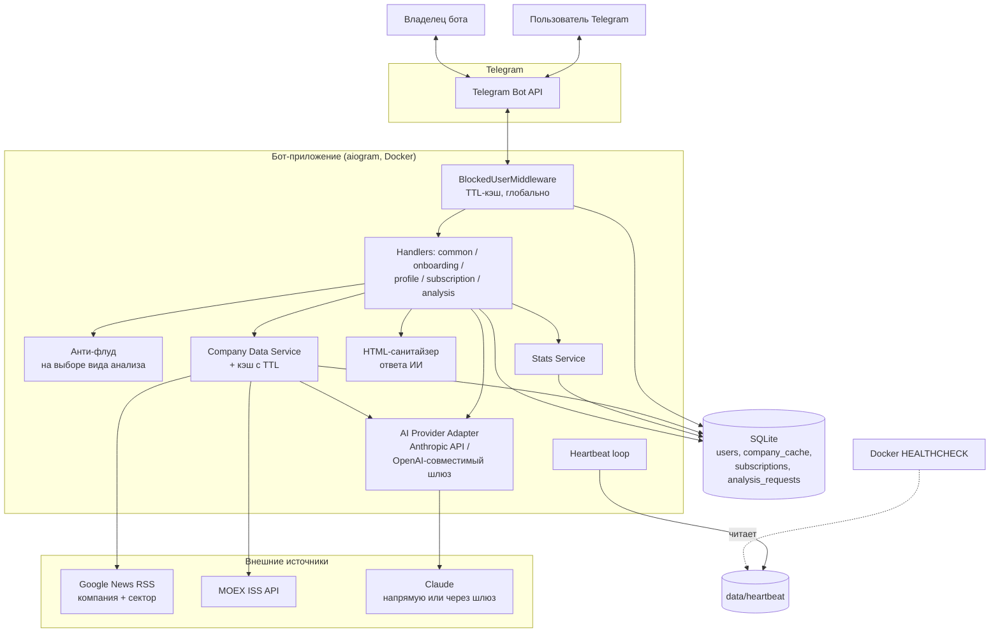
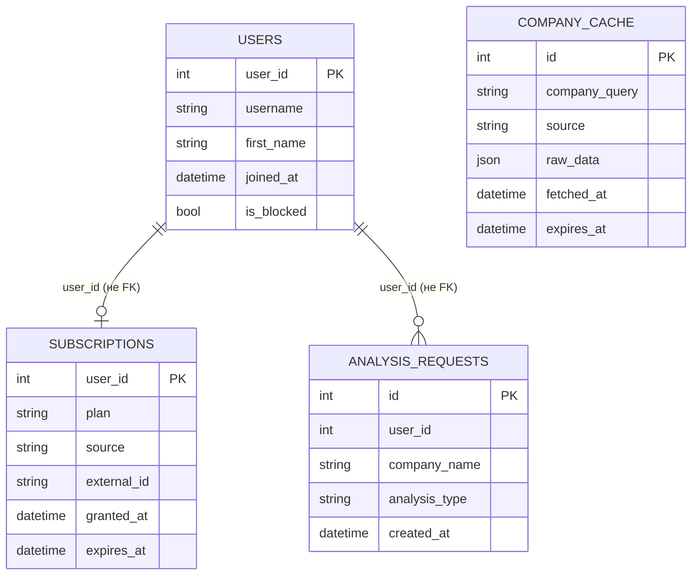
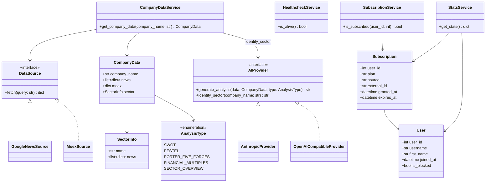
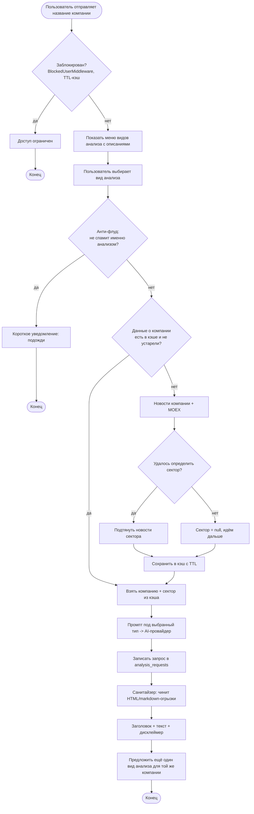
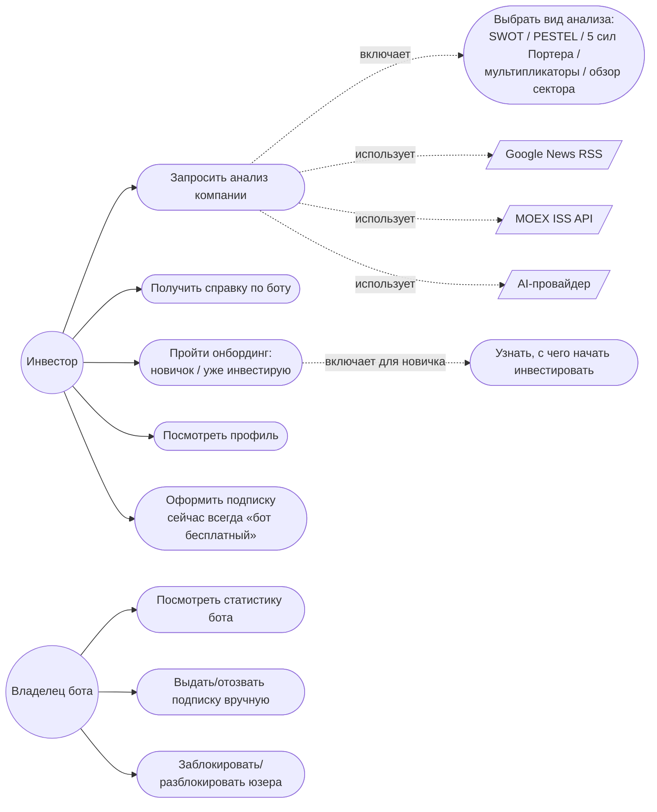

# Analysis for Invest Bot

**Бот в Telegram:** @analysis_for_invest_bot

Telegram-бот для инвесторов, который проводит анализ компаний по открытым источникам
(новости, биржевые данные) с помощью ИИ (Claude, в том числе через OpenAI-совместимые
шлюзы вроде Timeweb AI Gateway).

## Что делает бот

Пользователь отправляет боту название компании — бот собирает данные из открытых
источников (новости по компании и по её сектору, котировки и капитализация с MOEX)
и с помощью нейросети формирует структурированный анализ по одному из пяти
фреймворков: SWOT, PESTEL, 5 сил Портера, финансовые мультипликаторы или обзор
сектора. Сектор компании ИИ определяет сам и учитывает его контекст во всех видах
анализа, а не только в отдельном «Обзоре сектора».

Для новых пользователей есть отдельная ветка онбординга («Только начинаю» /
«Уже инвестирую») с базовой информацией о том, как вообще начать инвестировать —
без ИИ, статический текст. Бот везде явно указывает, что выдаёт только аналитику,
а не индивидуальные инвестиционные рекомендации.

После онбординга на экране постоянно висит reply-меню «📊 Анализ» / «👤 Профиль» —
начать новый разбор или посмотреть ID и тариф можно в любой момент, не только
сразу после выбора ветки. Есть заготовка под платную подписку — реальной оплаты
пока нет ни через один платёжный сервис, но структура (таблица подписок, ручная
выдача владельцем, `/subscription`) уже готова принять вебхук, когда он появится.

Владельцу бота (`OWNER_CHAT_ID`) доступны `/stats` с аналитикой по использованию
и ручная блокировка юзеров (`/block_user`, `/unblock_user`) — заблокированному
глобальная миддлварь режет вообще любое действие, ещё до хендлера.

## MVP-сценарий

1. Пользователь запускает бота (`/start`) → бот сохраняет юзера, показывает
   приветствие с дисклеймером и reply-кнопку «Начать»
2. «Начать» → бот спрашивает про опыт: «Только начинаю» / «Уже инвестирую»
3a. **Новичок** → инлайн-меню: «С чего начать» (статический текст: с 18 лет,
    брокерский счёт, ИИС — с кнопкой «Понял, дальше») или сразу «Анализ компаний»
3b. **Опытный** → инлайн-меню: «Анализ компаний» или «Виды анализа» (описание
    всех пяти фреймворков)
4. Пользователь отправляет название компании → бот показывает меню видов анализа
   с кратким описанием каждого и эмодзи
5. Пользователь выбирает вид анализа → бот проверяет анти-флуд (кулдаун именно на
   этом действии, не на каждом сообщении — дорогая операция это сбор данных + ИИ,
   а не сама переписка)
6. Бот проверяет кэш данных о компании (SQLite, TTL)
6a. Данные свежие в кэше → берёт их (компания + новости сектора уже внутри)
6b. Данных нет / устарели → собирает: новости по компании (Google News RSS),
    котировки и капитализация (MOEX ISS API), затем отдельным коротким запросом
    к ИИ определяет сектор и подтягивает новости уже по нему; если сектор
    определить не удалось — анализ компании всё равно идёт, просто без него
7. Бот отправляет собранные данные в AI-провайдера (Claude напрямую или через
   OpenAI-совместимый шлюз) с промптом под выбранный вид анализа
8. Бот отправляет юзеру заголовок + текст анализа + дисклеймер, затем предлагает
   выбрать ещё один вид анализа для той же компании (без повторного ввода названия)

## Дополнительные команды

| Команда / кнопка | Кто | Что делает |
|---|---|---|
| «📊 Анализ» / «👤 Профиль» (reply-меню) | любой юзер | Постоянно на экране после онбординга — начать разбор или глянуть ID и тариф |
| `/subscription` | любой юзер | Статус подписки + кнопка «Оформить» — отвечает, что бот сейчас бесплатный |
| `/stats` | только `OWNER_CHAT_ID` | Полная аналитика: пользователи, запросы анализа, топ компаний, статус heartbeat |
| `/grant_subscription <user_id> <дней>` | только `OWNER_CHAT_ID` | Вручную выдать подписку (единственный способ активировать её сейчас) |
| `/revoke_subscription <user_id>` | только `OWNER_CHAT_ID` | Отозвать подписку |
| `/block_user <user_id>` | только `OWNER_CHAT_ID` | Заблокировать юзера — любое его действие режется миддлварью |
| `/unblock_user <user_id>` | только `OWNER_CHAT_ID` | Разблокировать |

## Ключевые возможности

| Область | Что умеет |
|---|---|
| Онбординг | `/start` → reply-кнопки → ветка «новичок»/«опытный» → инлайн-меню под каждую, дальше постоянное reply-меню «Анализ»/«Профиль» |
| Виды анализа | SWOT, PESTEL, 5 сил Портера, финансовые мультипликаторы, обзор сектора — все реализованы |
| Учёт сектора | ИИ сам определяет отрасль компании, новости по сектору попадают во все виды анализа |
| Сбор данных | Google News RSS (компания + сектор) + MOEX ISS API (котировки, капитализация) |
| Кэш данных | Компания + сектор кэшируются вместе в SQLite с TTL, ключ нормализуется (`strip`+`casefold`) — «Лукойл»/«ЛУКОЙЛ»/«лукойл» не дёргают источники повторно |
| Производительность | Company- и sector-данные собираются параллельно (`asyncio.gather`); статус блокировки — TTL-кэш в памяти вместо sqlite-запроса на каждый update |
| AI-анализ | Claude — напрямую (Anthropic API) или через OpenAI-совместимый шлюз, провайдер переключается конфигом |
| Форматирование | Ответ ИИ прогоняется через HTML-санитайзер (чинит Markdown-огрызки, балансирует теги) перед отправкой; заголовок и дисклеймер добавляются в каждый ответ; fallback на обычный текст, если Telegram всё же забракует разметку |
| Анти-флуд | Кулдаун именно на запуске анализа (дорогая операция), не на сообщениях/кнопках онбординга |
| Устойчивость к сбоям | Ретраи при сетевых обрывах Telegram, понятная ошибка вместо тишины при недоступности ИИ/источников |
| Compliance | Единый дисклеймер («аналитика, не инвестрекомендация») во всех аналитических и справочных текстах |
| Модерация | Блокировка юзеров (`is_blocked` в `users`) — глобальная миддлварь режет любое взаимодействие заблокированного до хендлера, не точечно |
| Монетизация (структура) | Таблица `subscriptions`, ручная выдача владельцем — без гейта на функциях и без реального платёжного вебхука, но готово его принять |
| Хранение | Локальная SQLite: пользователи (+ флаг блокировки), кэш компаний, подписки, лог запросов анализа |
| Тесты | pytest, 83 теста на кэш/анти-флуд/выбор бумаги на MOEX/сборку промптов/санитайзер/healthcheck/статистику/блокировку |
| Деплой | Docker + docker-compose, heartbeat-healthcheck, `cloud-init.sh` для чистого сервера, CI на GitHub Actions (сборка образа + тесты на каждый push/PR) |

## Архитектура системы

```mermaid
graph TD
    U[Пользователь Telegram]
    OWNER[Владелец бота]

    subgraph TG["Telegram"]
        API[Telegram Bot API]
    end

    subgraph APP["Бот-приложение (aiogram, Docker)"]
        BM[BlockedUserMiddleware<br/>TTL-кэш, глобально]
        H[Handlers: common / onboarding /<br/>profile / subscription / analysis]
        AF[Анти-флуд<br/>на выборе вида анализа]
        CDS[Company Data Service<br/>+ кэш с TTL]
        AIP[AI Provider Adapter<br/>Anthropic API /<br/>OpenAI-совместимый шлюз]
        SAN[HTML-санитайзер<br/>ответа ИИ]
        STATS[Stats Service]
        HB[Heartbeat loop]
    end

    subgraph EXT["Внешние источники"]
        NEWS[Google News RSS<br/>компания + сектор]
        MOEX[MOEX ISS API]
        AI[Claude<br/>напрямую или через шлюз]
    end

    DB[(SQLite<br/>users, company_cache,<br/>subscriptions, analysis_requests)]

    U <--> API
    OWNER <--> API
    API <--> BM
    BM --> H
    BM --> DB
    H --> AF
    H --> CDS
    H --> AIP
    H --> SAN
    H --> STATS
    CDS --> NEWS
    CDS --> MOEX
    CDS --> AIP
    AIP --> AI
    CDS --> DB
    STATS --> DB
    H --> DB
    HB --> DB2[(data/heartbeat)]
    HC[Docker HEALTHCHECK] -.читает.-> DB2
```

## Схема базы данных (ER Diagram)

Только то, что реально персистится (анти-флуд — в памяти, не в БД). История
запросов пользователю не показывается — `ANALYSIS_REQUESTS` пишется только
для `/stats`, юзер к этим данным доступа не имеет:

```mermaid
erDiagram
    USERS {
        int user_id PK
        string username
        string first_name
        datetime joined_at
        bool is_blocked
    }

    COMPANY_CACHE {
        int id PK
        string company_query
        string source
        json raw_data
        datetime fetched_at
        datetime expires_at
    }

    SUBSCRIPTIONS {
        int user_id PK
        string plan
        string source
        string external_id
        datetime granted_at
        datetime expires_at
    }

    ANALYSIS_REQUESTS {
        int id PK
        int user_id
        string company_name
        string analysis_type
        datetime created_at
    }

    USERS ||--o| SUBSCRIPTIONS : "user_id (не FK)"
    USERS ||--o{ ANALYSIS_REQUESTS : "user_id (не FK)"
```

`COMPANY_CACHE` не связана ни с чем — кэш общий для всех пользователей, не
привязан к конкретному юзеру. `raw_data` — единый JSON-блок: новости компании,
данные MOEX и вложенный объект сектора (`{name, news}`) — отдельной таблицы под
сектор нет, он живёт внутри той же строки кэша.

`SUBSCRIPTIONS` и `ANALYSIS_REQUESTS` логически ссылаются на `USERS` через
`user_id`, но реального `FOREIGN KEY` в схеме нет — связь только по значению.
`ANALYSIS_REQUESTS` пишется при каждом успешном анализе (не только новом —
даже повторный запрос по компании из кэша считается) и существует исключительно
для `/stats`; `COMPANY_CACHE` для этого не годится, потому что там `UPSERT`
и повторные запросы одной компании не растят счётчик.

## Доменная модель (Class Diagram)

```mermaid
classDiagram
    class User {
        +int user_id
        +str username
        +str first_name
        +datetime joined_at
        +bool is_blocked
    }

    class AnalysisType {
        <<enumeration>>
        SWOT
        PESTEL
        PORTER_FIVE_FORCES
        FINANCIAL_MULTIPLES
        SECTOR_OVERVIEW
    }

    class CompanyData {
        +str company_name
        +list~dict~ news
        +dict moex
        +SectorInfo sector
    }

    class SectorInfo {
        +str name
        +list~dict~ news
    }

    class CompanyDataService {
        +get_company_data(company_name: str) CompanyData
    }

    class AIProvider {
        <<interface>>
        +generate_analysis(data: CompanyData, type: AnalysisType) str
        +identify_sector(company_name: str) str
    }

    class AnthropicProvider
    class OpenAICompatibleProvider

    class DataSource {
        <<interface>>
        +fetch(query: str) dict
    }

    class GoogleNewsSource
    class MoexSource

    class HealthcheckService {
        +is_alive() bool
    }

    class Subscription {
        +int user_id
        +str plan
        +str source
        +str external_id
        +datetime granted_at
        +datetime expires_at
    }

    class SubscriptionService {
        +is_subscribed(user_id: int) bool
    }

    class StatsService {
        +get_stats() dict
    }

    CompanyDataService --> DataSource
    CompanyDataService --> CompanyData
    CompanyDataService --> AIProvider : identify_sector
    CompanyData --> SectorInfo
    AIProvider <|.. AnthropicProvider
    AIProvider <|.. OpenAICompatibleProvider
    DataSource <|.. GoogleNewsSource
    DataSource <|.. MoexSource
    CompanyData --> AnalysisType
    SubscriptionService --> Subscription
    Subscription --> User
    StatsService --> User
    StatsService --> Subscription
```

`SubscriptionService.is_subscribed()` пока нигде не вызывается как гейт — функция
существует, но ни одна фича бота не проверяет подписку перед выполнением. В
отличие от неё, `is_blocked` — реальный гейт: его проверяет `BlockedUserMiddleware`
на каждом апдейте (с TTL-кэшем, см. архитектуру).

## Жизненный цикл обращения (Activity Diagram)

```mermaid
flowchart TD
    Start([Пользователь отправляет название компании]) --> Blocked{Заблокирован?<br/>BlockedUserMiddleware, TTL-кэш}
    Blocked -- да --> Reject[Доступ ограничен] --> End0([Конец])
    Blocked -- нет --> Menu[Показать меню видов анализа с описаниями]
    Menu --> Choice[Пользователь выбирает вид анализа]
    Choice --> Flood{Анти-флуд:<br/>не спамит именно анализом?}
    Flood -- да --> WaitMsg[Короткое уведомление: подожди] --> End1([Конец])
    Flood -- нет --> Cache{Данные о компании<br/>есть в кэше и не устарели?}
    Cache -- да --> UseCache[Взять компанию + сектор из кэша]
    Cache -- нет --> Fetch[Новости компании + MOEX]
    Fetch --> Sector{Удалось определить сектор?}
    Sector -- да --> SectorNews[Подтянуть новости сектора]
    Sector -- нет --> NoSector[Сектор = null, идём дальше]
    SectorNews --> SaveCache[Сохранить в кэш с TTL]
    NoSector --> SaveCache
    SaveCache --> UseCache
    UseCache --> AI[Промпт под выбранный тип -> AI-провайдер]
    AI --> Log[Записать запрос в analysis_requests]
    Log --> Sanitize[Санитайзер: чинит HTML/markdown-огрызки]
    Sanitize --> Send[Заголовок + текст + дисклеймер]
    Send --> Offer[Предложить ещё один вид анализа для той же компании]
    Offer --> End2([Конец])
```

## Карта прецедентов (Use Case Diagram)

```mermaid
flowchart LR
    Investor((Инвестор))
    Owner((Владелец бота))
    News[/Google News RSS/]
    Moex[/MOEX ISS API/]
    AIExt[/AI-провайдер/]

    UC1([Запросить анализ компании])
    UC2([Выбрать вид анализа:<br/>SWOT / PESTEL / 5 сил Портера /<br/>мультипликаторы / обзор сектора])
    UC3([Получить справку по боту])
    UC4([Пройти онбординг:<br/>новичок / уже инвестирую])
    UC5([Узнать, с чего начать инвестировать])
    UC6([Посмотреть профиль])
    UC7([Оформить подписку<br/>сейчас всегда «бот бесплатный»])
    UC8([Посмотреть статистику бота])
    UC9([Выдать/отозвать подписку вручную])
    UC10([Заблокировать/разблокировать юзера])

    Investor --> UC1
    Investor --> UC3
    Investor --> UC4
    Investor --> UC6
    Investor --> UC7
    Owner --> UC8
    Owner --> UC9
    Owner --> UC10
    UC4 -.включает для новичка.-> UC5
    UC1 -.включает.-> UC2
    UC1 -.использует.-> News
    UC1 -.использует.-> Moex
    UC1 -.использует.-> AIExt
```
